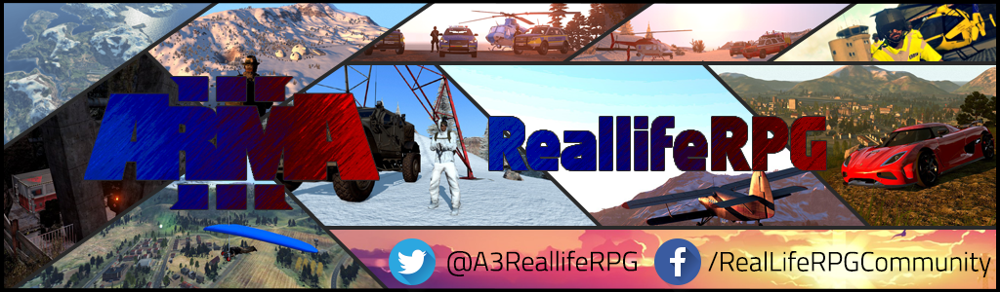

# RealLifeRPGLauncher

   

##EN
This is the official launcher/download-client of [realliferpg.de](https://www.realliferpg.de)

We open-sourced our launcher because ReallifeRPG want to support the Arma Community and overall supports open and free code.

If you want to use our launcher for your project, please change the icon and bootstrap theme.
We don't offer any real API Documentation but you can take a look at the [ReallifeRPG API](https://dev.realliferpg.de/docs/api) ([Endpoint example](https://api.realliferpg.de/v1/servers))

##DE
Willkommen im Repository des RealLifeRPG Launchers.

Unser Launcher ist OpenSource, ihr könnt euch die gesammte Source herunterladen/bearbeiten.  

<<<<<<< Updated upstream
Gerne könnt ihr auch zur Weiterentwicklung beitragen, mehr Infos dazu findet ihr weiter unten.

Wir haben unseren Launcher öffentlich gemacht, um der Arma Community in diesem Bereich einen kleinen Anstoß zu geben, ebenfalls über Open Source Lösungen nachzudenken.
Wenn ihr den Launcher nutzen wollt oder von ihm lernt würden wir uns über ein bisschen Credit sehr freuen und bitte ändert aus rein praktikablen Gründen für die Nutzer Icon und Bootstrap Theme.

RealLifeRPG ist eine Arma3 Gaming Community.

Wir bringen euch seit 2014 Arma3 Modded Roleplay, mit vielen neuen Jobs, Fahrzeugen, Flugzeugen und auf Isla Abramia.

Wenn ihr mehr erfahren wollt besucht uns doch mal auf unserer [Website](https://www.realliferpg.de) oder auf unserem [Teamspeak 3 Server](ts3server://ts.realliferpg.de?port=9987).

## install

**Install**:

Download the newest [release](https://github.com/A3ReallifeRPG/RealLifeRPGLauncher/releases), we offer a updating installation using squirrel.windows and a portable version based on nsis.

**Running from source**:

1. Download [NodeJs](https://nodejs.org/en/)
2. Clone this repo `git clone https://github.com/A3ReallifeRPG/RealLifeRPGLauncher.git`
3. Install required depedencies `npm i`
4. Start using `npm start` oder build a portable windows launcher `build -w portable`

## credits

The client is based on [Electron](http://electron.atom.io/)

You can find the npm packages used in the `package.json`

## license

The ReallifeRPG Launcher is licensed under the [GNU General Public License version 3](https://opensource.org/licenses/GPL-3.0)
