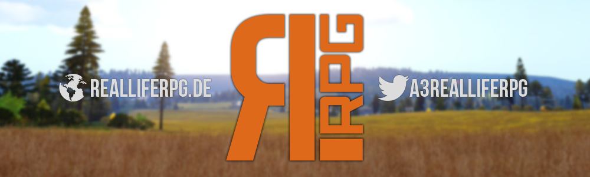

# RealLifeRPGLauncher

   

Willkommen im Repository des RealLifeRPG Launchers.

Unser Launcher ist OpenSource, ihr könnt euch die gesammte Source herunterladen/bearbeiten.  

Gerne könnt ihr auch zur Weiterentwicklung beitragen, mehr Infos dazu findet ihr weiter unten.

Wir haben unseren Launcher öffentlich gemacht um der Arma Community in diesem Bereich einen kleinen Anstoß zu geben ebenfalls über Open Source Lösungen nachzudenken.
Wenn ihr den Launcher nutzen wollt oder von ihm lernt würden wir uns über ein bisschen Credit sehr freuen und bitte ändert aus rein praktikablen Gründen für die Nutzer Icon und Bootstrap Theme.

## Über RealLifeRPG

RealLifeRPG ist eine Arma3 Gaming Community.

Wir bringen euch seit 2014 Arma3 Modded Roleplay, mit vielen neuen Jobs, Fahrzeugen, Flugzeugen und auf Isla Abramia.

Wenn ihr mehr erfahren wollt besucht uns doch mal auf unserer [Website](https://www.realliferpg.de) oder auf unserem [Teamspeak 3 Server](ts3server://ts.realliferpg.de?port=9987).

## install

**Automatische Installation**:

Ladet euch das neueste Build aus den [releases](https://github.com/A3ReallifeRPG/RealLifeRPGLauncher/releases) und installiert es wie jede andere Windows Anwendung.

**Manuelle Installation**:

1. Installiert euch [NodeJs](https://nodejs.org/en/)
2. Cloned dieses Repository mit `git clone https://github.com/A3ReallifeRPG/RealLifeRPGLauncher.git`
3. Installiert alle dependencies mit `npm install`
4. Startet den Launcher mit `npm start` oder baut euch einen Windows installer mit `npm run dist`

## credits

Der RealLifeRPG Launcher basiert auf [Electron](http://electron.atom.io/), einem Framework zur Entwicklung von Desktop Anwendungen mit HTML, Javascript und CSS.

Vielen Dank auch an alle Entwickler der verschiedenen Bibilotheken, eine genaue Liste findet ihr in der `package.json` die Bibilotheken selber auf [NPM](https://www.npmjs.com/)

## contribute

Du willst deinen Teil zur Entwicklung des Launchers beitragen ?  

Dann Fork dir dieses Repository und erstelle einen Pull Request mit deinen Änderungen.

## license

The ReallifeRPG Launcher is licensed under the [GNU General Public License version 3](https://opensource.org/licenses/GPL-3.0)